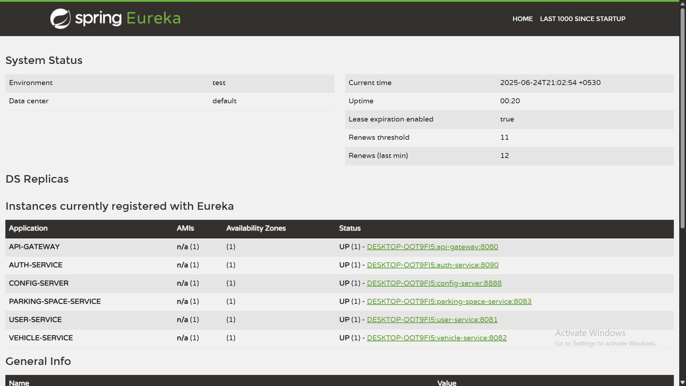

# 🚗 Smart Parking Management System

A microservice-based backend project built with Spring Boot and Spring Cloud.

---

## 🛠 How to Run

1. **Clone the repository**
   ```bash
   git clone https://github.com/your-username/smart-parking-management-system.git
   ```

2. **Run the following services in this exact order:**

   1️⃣ `eureka-server`  
   2️⃣ `config-server`  
   3️⃣ `auth-service`  
   4️⃣ `api-gateway`  
   5️⃣ `user-service`  
   6️⃣ `vehicle-service`  
   7️⃣ `parking-space-service`  

3. **Access tools**
   - 🔗 Eureka Dashboard: `http://localhost:8761`
   - 🔗 API Gateway: `http://localhost:8080`

---

## 📂 Postman Collection

- [Postman Collection](./postman_collection.json)

---

## 📸 Eureka Dashboard

- 
